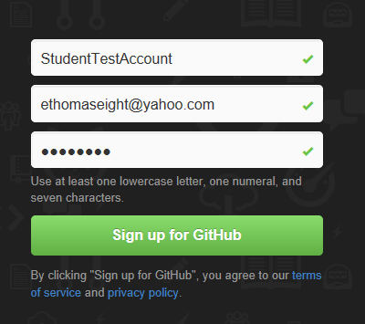

Tools for this course
=====================
The following tools will be used in this course:

1. Visual Studio Express 2013 for Windows Desktop
2. Git
3. Github
4. Google Test

Visual Studio 2013
------------------
Any version of Visual Studio 2013 which compiles C++ will work. I'm using Visual Studio Express 2013 for Windows Desktop. It can be downloaded [here](http://www.microsoft.com/en-us/download/details.aspx?id=40787). After downloading it, perform a full installation.

If you are not using Windows, any C++ compiler with support for the C++11 threading library will work.

Git
---
Git is a distributed version control utility. On Windows, I'm using MsysGit from [here](http://msysgit.github.io/), version 1.8.3.

Configure Git using the following commands:

<pre>
git config --global user.name "John Doe"
git config --global user.email johndoe@example.com
git config --global credential.helper "cache --timeout=3600"
</pre>

The first two commands set your user name and email address, used to mark commits. The last command will cache your Github password for one hour.

Github
------
Github is a website which provides free Git repository hosting, code sharing, and code review. I'll be pushing all of the code and notes for the course to Github.

* Browse to [http://github.com] (http://github.com) and sign up for an account (if you don't already have an account).

* Browse to the Github [site](https://github.com/joshpeterson/DevelopingConcurrentSoftware) for this course.
* Fork the repository

* Clone the repository to your machine, using your Git utility. Find the HTTPS URL for your repository.

<pre>git clone https://github.com/YourUsername/DevelopingConcurrentSoftware.git</pre>

Google Test
-----------
Google Test is a C++ unit testing framework. In order to use it with Visual Studio 2013, I have made a few modifications (details are available [here](http://stackoverflow.com/questions/12558327/google-test-in-visual-studio-2012)). To install it:

1. Download my modified and built version Google Test [here](https://docs.google.com/file/d/0B_iq84mNTIzZU2dIZkRNX1gwVUk/edit?usp=sharing) (choose File > Download from the menu)
2. Extract the .zip file to some location on your machine
3. Set the GTEST_DIR environment variable to point to the location of the extracted file. For example, if you extracted the files to C:\Development, then

<pre>GEST_DIR=C:\Development\gtest-1.6.0-modified</pre>

Verification
------------

To verify your configuration is set up correctly:

1. From the source tree, open the ScratchSolution\ScratchSolution.sln solution file in Visual Studio 2013.
2. Build the solution
3. Right-click on the Test project and select "Set as StartUp Project"
4. Use Ctrl-F5 to run the test project

If you see all of the projects build correctly and the test passes, then your configuration is correct.
